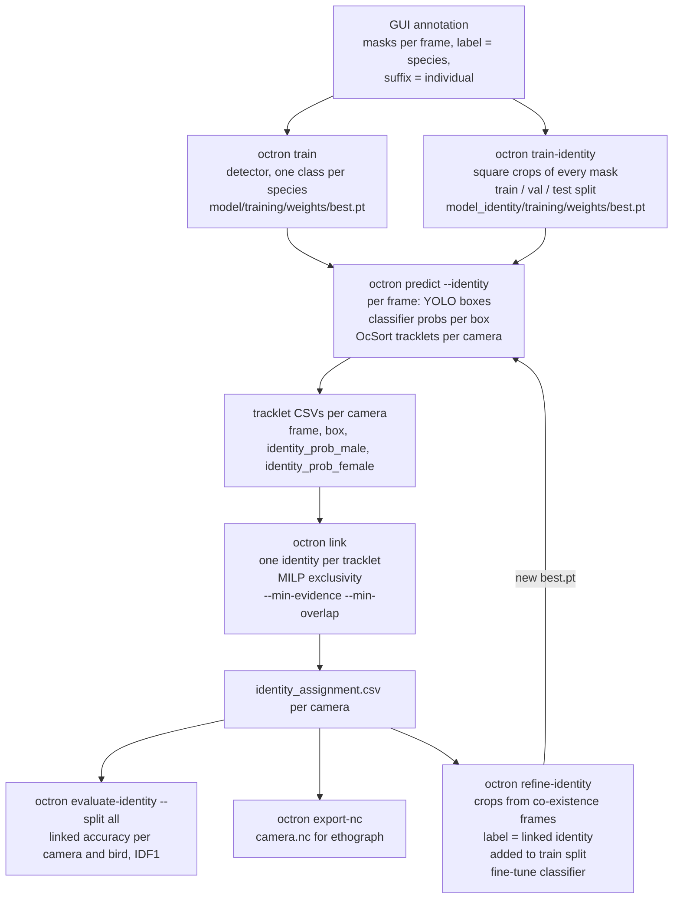
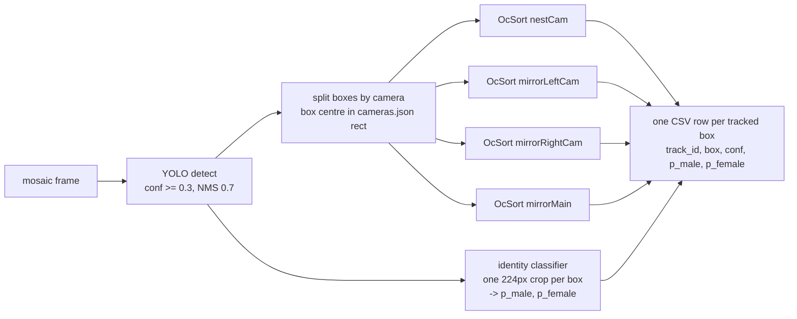

# Multicam identity pipeline, as it runs today (2026-09-11)

Everything below is what `retrain.ps1` in the project folder does, in
order. Files in `<project>` = `C:\Users\aksel\Documents\octron`.

## The whole loop

The loop `predict -> link -> refine -> predict` is the self-training
cycle. Everything upstream of `predict` (annotation, detector,
classifier seed) is done once per labelling round.

## What one frame goes through in `predict`

The tracker never sees the identity probabilities. It only decides
"which box continues which track" from motion. The probabilities ride
along in the CSV for `link`.

## What `link` does, with the real numbers

Input: all tracklet CSVs of the four camera folders.

1. **Sum per tracklet.** For each tracklet, add up `p_male` and
   `p_female` over its frames. A 4752-frame tracklet whose crops say
   female at 0.86 on average gets `female = 4075`, `male = 677`.
   `evidence = 4075 - 677 = 3398` ("confident frames of net evidence").
2. **Drop the undecidable.** `--min-evidence 5`: a tracklet whose
   evidence is below 5 is left unassigned (`reason = low_evidence`)
   instead of guessed. Typically 20-frame fragments seen from behind.
3. **Who co-exists.** Two tracklets in the same camera that share at
   least `--min-overlap 10` frames are two different animals. (Fewer
   shared frames = the tracker handing one animal from a dying track to
   a new one; ignored.)
4. **Solve exactly.** Integer program: give each tracklet at most one
   identity, co-existing tracklets never the same identity, maximise the
   total summed score. This is where *elimination* happens: in the nest
   camera the male's tracklet looks female (p_female = 0.77) but
   co-exists with a tracklet that is female with evidence 3398, so it
   gets male.
5. **Report.** `identity_assignment.csv`: identity, score, runner-up,
   evidence, `flagged` (unassigned, or best < 1.5x runner-up),
   `reason`. `link_report.json` lists the flagged ones.

Cross-camera exclusivity for non-overlapping views is available
(`non_overlapping` in `cameras.json`, or `--exclusive A:B`) but does
not apply to this rig: the nest is visible in the mirrors. Not done
(yet): duplicate suppression.

## What `refine-identity` does

Input: the linked folders. Output: a retrained classifier.

1. Find the **co-existence frames** of each camera: frames in which
   every individual of a label is assigned to a tracklet there (both
   birds present). Only these are used: there `link` decided the
   identities by exclusivity and elimination, and they are 86-100 %
   correct; lone-bird frames were 37-88 % correct and poisoned the
   classifier when used.
2. For every assigned tracklet, take up to `--max-per-tracklet 50` of
   its co-existence frames, spread evenly. Skip frames that are in the
   identity dataset's `val` or `test` split of this video.
3. Cut the same square crop `predict` used (camera crop, box, 10 %
   padding) from the mosaic video and save it as
   `model_identity/training_data/train/<identity>/pseudo_<cam>_<track>_<frame>.png`.
   One crop per bird per frame, so the export is balanced by construction.
4. Fine-tune the classifier from the current `best.pt` on hand-labelled
   + pseudo crops (`train`), validating on the hand-labelled `val`
   (`--epochs`; the first round peaked at epoch 8 of 30).
5. `predict` again with the new weights, `link`, `evaluate-identity`.

`--all-frames` uses every assigned frame instead; `--clear` removes
pseudo crops of earlier rounds. Weights of the previous round are kept
as `model_identity/best_before_refine.pt`.

## What `evaluate-identity` measures

By default only annotated frames in the identity **test** split (15 per
camera here), which is too few to trust: use `--split all` (353
frames; the classifier saw the train ones, `link` did not). For every
annotated bird: is there a detection (IoU >= 0.5), and
is its *linked* identity the annotated one? `acc lnk` is that fraction.
IDF1 columns say whether the same bird kept the same id (raw track ids
/ per-frame classifier / linked). IDF1 is blind to a consistent swap;
accuracy is not.

`flip_rate.py` (project folder) is the complementary number on the
*whole* video: among consecutive same-camera tracklets close in time
and space, how often does the linked identity change. Baseline 24.5 %.

## Files that carry state

| file | written by | read by |
|---|---|---|
| `<project>/<video>/object_organizer.json`, `*masks.zarr` | GUI | train, train-identity, evaluate |
| `model/training/weights/best.pt` | train | predict |
| `model_identity/training_data/{train,val,test}/` | train-identity, refine | train-identity, refine, evaluate (split membership) |
| `model_identity/training/weights/best.pt` | train-identity, refine | predict |
| `octron_predictions/<video>_<tracker>/<cam>/*_track_*.csv` | predict | link, refine, evaluate, export |
| `.../<cam>/identity_assignment.csv`, `link_report.json` | link | refine, evaluate, export |
| `.../<cam>/identity_eval.json` | evaluate | you |
| `OUTPUT PER VIDEO/<cam>.nc` | export-nc | ethograph |
